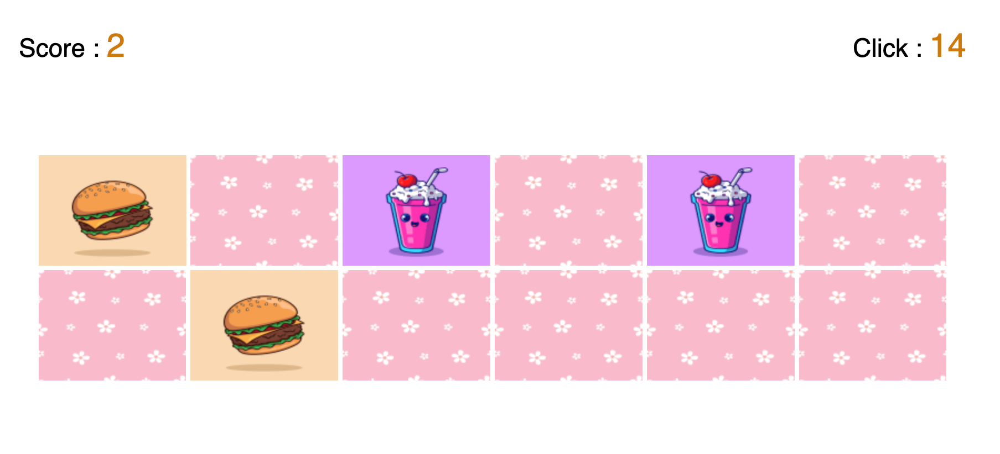

# memoryGame

### This game contains a set of cards "images" which are turned to the back, when the player clicks on an image, it flips over and reveals the image. If player clicks on two images that are exactly the same, player wins.

