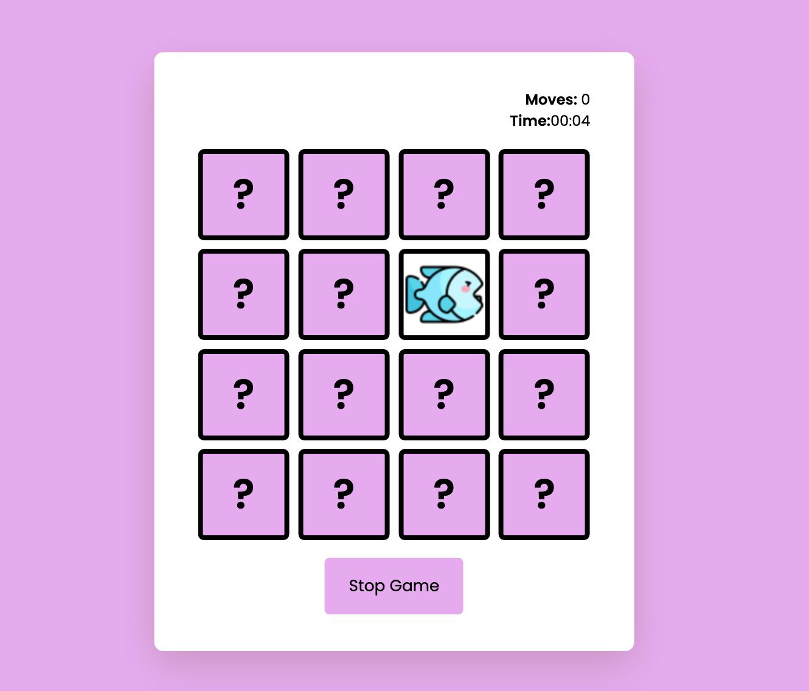

# Memory Game:       

### Memory Game is a fun and challenging game that tests your memory skills. 
#### The objective of the game is to match all of the cards by flipping them over two at a time. The game features a start button to begin the game and an end button to stop the game at any time. There is also a timer to track the player's progress.       

#### To win the game, the player must match all of the cards. If the player matches all of the cards, they win the game. The game is easy to play, but challenging to master.      

#### To get started, simply click on the start button to begin the game. The cards will be displayed face down, and you can flip them over by clicking on them with your mouse. If you flip over two cards that are exactly the same, they will remain face up, and you can continue to flip over more cards. If you want to end the game at any time, simply click on the end button. The game will stop, and you can start a new game by clicking on the start button again.       

#### Enjoy playing Memory Game, and see how long it takes to match all cards!

